```
> DOSSIER #JHV-7749
> SCANNING...

  DESIGNATION    : Jan-Hendrik de Vaal
  RANK           : Software Engineer (Mobile)
  CHARGES        : [1] Androidmancy
                   [2] Kotlin Multiplatform Maleficium
  PURSUIT        : Further command through binary trials that
                   test the limits of cognitive and creative
                   capabilities

> VERDICT        : SANCTIONED BY THE OMNISSIAH ✓
```

### Freelance work 👨🏻‍💻

- [my resume](https://github.com/user-attachments/files/26438990/Jan-Hendrik_de_Vaal_CV_apr_2026.pdf)
- contact me through the channels on the sidebar
- or look for me on one of the following freelance platforms:
<a href="https://www.toptal.com"></a>
<a href="https://andela.com/"></a>
<a href="https://www.turing.com/"></a>
<a href="https://arc.dev">-075AFF?style=for-the-badge&w=128&q=75&logoColor=FFFFFF)</a>
<a href="https://gun.io"></a>

### 📈
<p align="left">
  
  
</p>

### 💰
<p align="left">
  <a href="https://www.buymeacoffee.com/jhdevaal" target="_blank"></a>
</p>
